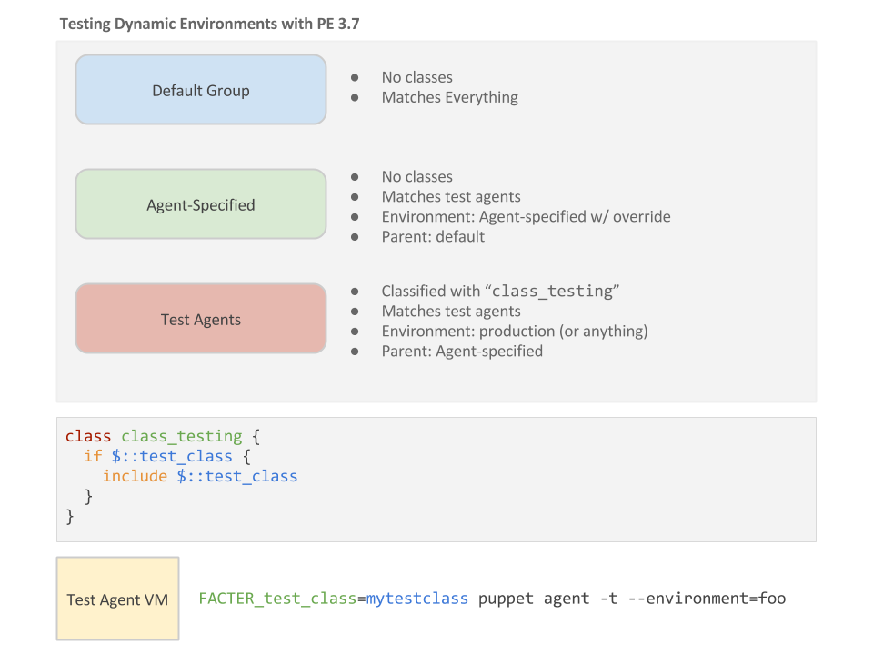

# PE 3.7 Dynamic Environment Workflow

__This document is still under development (e.g. better wording)__

## Overview

The situation that we're trying to provide an answer to:

* We want to be able to allow certain agents to override their environment
* We want those agents to be able to quickly test aribtrary classes and
  environments without having to use the node classifier.

Having to classify a node with a class that you just want to quickly try out
is a little cumbersome.  A typical workflow looks like this:

1. User creates/modifies a class
2. Control repository is updated (e.g. if the class is a role/profile or to
   update the `Puppetfile`, etc).
3. Push code to VCS server
4. r10k deploys the code to master(s)

At this point, the user's ready to test their work.  They likely created a
feature branch in the control repository, which provides a new Puppet
environment to test agents against. Thier new class might only be available in
this new environment.  If they're iterating on
a class that's been established and have a group that's already classified with
it, then they can simply add a node to a console group with an
"agent-specified" environment.  If it's a brand new class, or one they just
want to tinker with, they'll need to classify a group with it.  This probably
involves creating a new group just for this test.

This might not be a big deal, but it seems to introduce more overhead than
desired.

How can we quickly test agents with an arbitrary class in an agent-specified
environment?

## Method #1



1. Ensure that the _default_ group doesn't have any classification.
2. For any classes that would normally apply to the default group, you might
   consider creating a secondary "default" group that matches everything and
   gets classified with what you want (e.g. PE Agents)
3. Create a new group in the console, for example "Agent Specified". Don't
   classify this with anything, make it _match_ your test nodes (or pin some
   to it), set the environment to _agent-specified_ and _override_ other
   groups, and make its parent _default_.
4. Create another node group, maybe "Test Agents".  Classify this with the
   `class_testing` class (see below), make it also match your test agents,
   set the environment to _production_ (or anything, really), and the _parent_
   to the "Agent-Specified" group you created in step 3.

__What this does__

Agents will now be able to override their environment themselves because they
are members of the "agent specified" group.  This group has the "override other
groups" flag set, which means it will always win (allowing the agent-specified
group to always win).  They are also members of the "Test Agents" group, which
is classified with the `class_testing` class.  This class' sole purpose is to
evaluate a top-scope variable and `include` its value if it's set.

Nodes can be a member of the test group based on whatever logic is appropriate.
For example, maybe this group matches the value of `clientcert` against a
regex pattern such as _"vagrant"_.  Maybe a custom fact is made available on
test agents that this group matches against. Maybe `virtual == virtualbox` is
the criteria.

This affords users the ability to use the new environment-locking of non-test
agents while taking advantage of the `agent-specified` setting to allow
minimal-friction testing of test agents, such as short-lived vagrant instances
or cloud instances.

__`class_testing`__

```puppet
class class_testing {
  if $::test_class {
    include $::test_class
  }
}
```

And a test run:

```shell
FACTER_test_class=role::something::new \
  puppet agent -t --environment=feature43
```

In this solution, we used a _component module_ on purpose.  This allows us to
have a drop-in module that's available in all environments.  Since we're
letting the node classifier manage the environment for non-test agents and have
only classified the test node group with this class, we don't risk production
agents from changing classification.  __Only the nodes that are a member of
the test group will be able to use this functionality.__

The component module also makes this easily removable in the future, should
workflow improvements be made.

Our simple class for including the top-scope variable is _available_ in all
environments, and that's fine.  Again, it's only used in the test group.

You'll at least need this class available in the __parent__ group of the
test group.  When you set the "agent-specified" group's classification, the
node classifier will search for the test class in the `modulepath` for that
environment.  If it's not there, you cannot classify that test group with it.

## Method #2

`site.pp` can be utilized to offer similiar functionality as solution #1.
However, keep in mind that `site.pp` is global, so some precautions would need
to be taken to prevent non-test nodes from overriding their classification.

This method avoids needing to classify a group in the console at all. However,
a test node still needs to be a member of a group that allows for
agent-specified environments.

In `site.pp`, for example:

```puppet
$protected_environments = [
  'production',
  'staging',
  'dev',
]

unless member($protected_environments, $::environment) {
  if $::testclass {
    include $::testclass
  }
}
```

And a test run:

```shell
FACTER_testclass=role::something::new \
  puppet agent -t --environment=feature43
```

## Method #3

See [https://docs.google.com/a/puppetlabs.com/drawings/d/1qTbdrtobn-PI97z1z9kQ3WWLnQD_pL4ovH_6qXt0mhQ/edit](https://docs.google.com/a/puppetlabs.com/drawings/d/1qTbdrtobn-PI97z1z9kQ3WWLnQD_pL4ovH_6qXt0mhQ/edit)

TODO: Some words about this here.

## Other Things

__Classifying test nodes using the API__

This was discussed.  We could leverage the new REST API to create a temporary
group during testing, classify that group with the class(es) we want to test,
and remove it when it's done.  However, that would require SSL certificates to
be used and resourced by something secure.  We certainly don't want our test
agents doing this - having keys to the classifier.  Other solutions seem more
complicated and maybe fragile for this use case.

__Create a 'dev' group that inherits production__

What this means is - we have a node group for "production."  Its environment
is locked and it's classified as desired.  To test new code for that group,
we could create a child group that inherits it and set the environment to
'agent-specified.'  This only solves one of the problems - being able to test
against test environments.  What about testing brand new code that the parent
environment isn't classified with?  We don't want to have to classify a group
with that test code just to test it.  Multiply this several times and you'd
see the implications it has on a fluid workflow.  This would commonly involve
either removing that temporary classification after our testing or
adding/removing groups to test.

__Don't use the node classifier__

The features of 3.7 are compelling and desirable by customers.  They want RBAC
and an API.  They want the environment-locking for non-test nodes.  However,
they still want to be able to easily test arbitrary things quickly without
a lot of overhead or complexities.

__Adopt a new workflow for the 3.7 classifier__

From our findings, a workflow that offers that dynamic isn't possible with 3.7
for the reasons mentioned above.  If it's difficult to test, testing is in
jeopordy of not being performed.

__What would a formal procedure look like in product__

Not sure.  Ideas?

__This is too hacky__

We're interested in other solutions that allow for easily testing new code in
test environments that don't sacrifice the new classifier features for non-test
agents.

## References

TODO: Describe these links

* [https://tickets.puppetlabs.com/browse/PE-7236](https://tickets.puppetlabs.com/browse/PE-7236)
* [https://tickets.puppetlabs.com/browse/PE-7237](https://tickets.puppetlabs.com/browse/PE-7237)

* [https://docs.google.com/a/puppetlabs.com/document/d/1WIx2MZvyDXZnUNIpSqJgHSPbtgTlaXo2_IPpKSX6kJM/edit#heading=h.ddo08018ox5v](https://docs.google.com/a/puppetlabs.com/document/d/1WIx2MZvyDXZnUNIpSqJgHSPbtgTlaXo2_IPpKSX6kJM/edit#heading=h.ddo08018ox5v)

* [https://docs.google.com/a/puppetlabs.com/document/d/1caRuLnTy1WBdfgnuM36gB6VewpcJ3aa4auPQiB47aCo/edit#heading=h.ipok8cwppz55](https://docs.google.com/a/puppetlabs.com/document/d/1caRuLnTy1WBdfgnuM36gB6VewpcJ3aa4auPQiB47aCo/edit#heading=h.ipok8cwppz55)

* [https://docs.google.com/a/puppetlabs.com/document/d/1SHLSQzFdkBaowTX2WYJ7jTzqP1KzsP4nG74eism27bQ/edit#heading=h.qz22cjl5om1b](https://docs.google.com/a/puppetlabs.com/document/d/1SHLSQzFdkBaowTX2WYJ7jTzqP1KzsP4nG74eism27bQ/edit#heading=h.qz22cjl5om1b)

* [https://confluence.puppetlabs.com/pages/viewpage.action?title=Changes+For+PSEs+in+PE+3.7&spaceKey=PS](https://confluence.puppetlabs.com/pages/viewpage.action?title=Changes+For+PSEs+in+PE+3.7&spaceKey=PS)

* [https://docs.google.com/a/puppetlabs.com/drawings/d/1qTbdrtobn-PI97z1z9kQ3WWLnQD_pL4ovH_6qXt0mhQ/edit](https://docs.google.com/a/puppetlabs.com/drawings/d/1qTbdrtobn-PI97z1z9kQ3WWLnQD_pL4ovH_6qXt0mhQ/edit)

## People

Devised during the 2015 SSKO by Ranjit Viswakumar, Andrew Brader, Robert Maury,
and  Josh Beard
